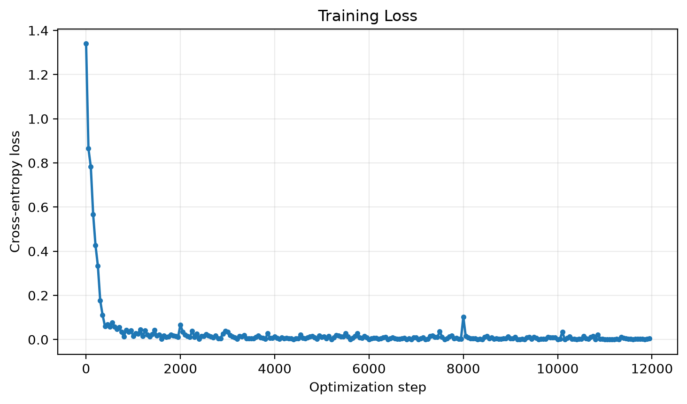
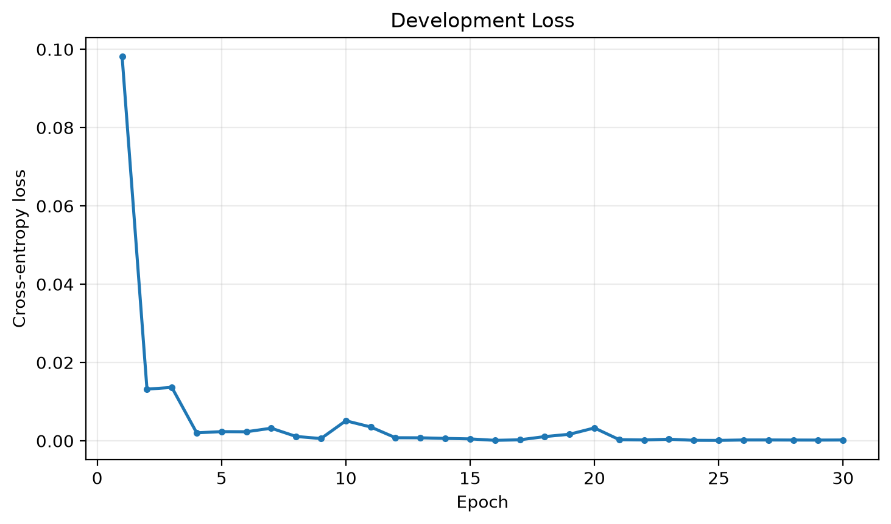
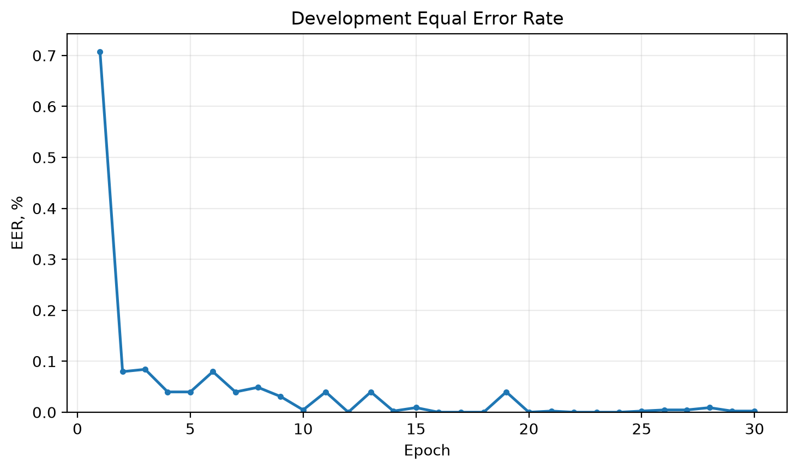
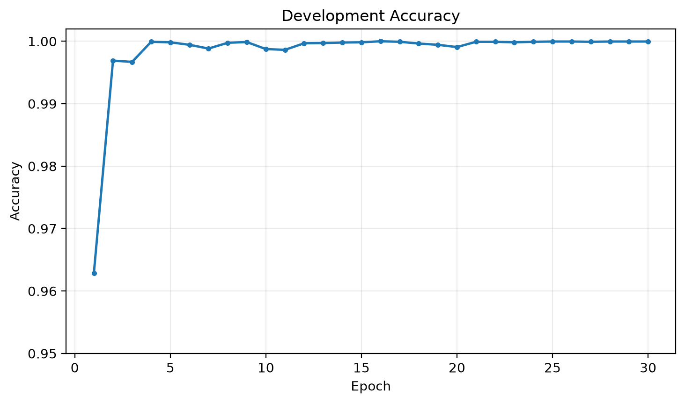

# LCNN Countermeasure — ASVspoof 2019 LA

- [GitHub repository](https://github.com/Kirtsuha/lcnn_hw)
- [Weights & Biases report](https://api.wandb.ai/links/batukhtin-kir-hse-university/woaavkiv)

## Result

The project implements an LCNN-based binary classifier for detecting spoofed
speech in the ASVspoof 2019 Logical Access dataset. Audio is represented using
log-power STFT features. The model was trained with cross-entropy loss and a
balanced sampler, while the checkpoint was selected by development EER.

The selected model achieved **7.9114% EER** on all **71,237** utterances from
the official evaluation split. The supplied grading script produced a score of
**6.27** before the PyTorch Project Template bonus.

## Training curves

Training loss decreased rapidly and remained close to zero for most of the
run.

Development loss was measured on the complete development split after every
epoch.

Development EER reached its minimum during training and was used for checkpoint
selection. Lower EER is better.

Development accuracy remained high throughout the run; the graph uses a
zoomed vertical scale to make small changes visible.

## Notes

The experiment was tracked in W&B, including train/dev losses and development
metrics. The evaluation split was used only for the final inference and was not
used for model or checkpoint selection.
